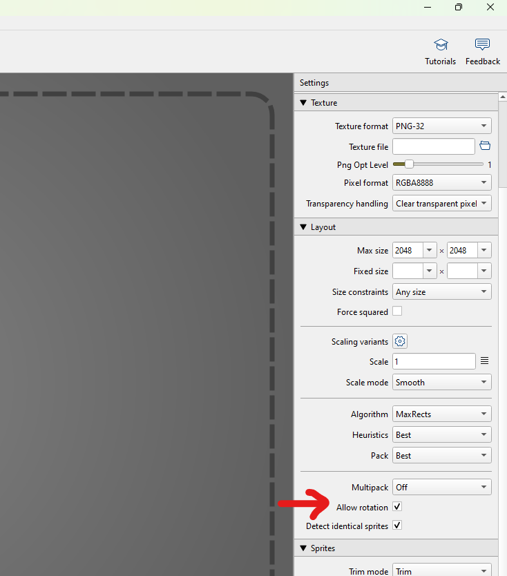

# How to edit or add new sprite to the game

## Overview

The project now supports **TexturePacker JSON atlases**. The parser automatically extracts sprite frame coordinates from the JSON metadata.

## File Structure

Each TexturePacker texture requires two files in the `content/` directory:

```text
content/
├── my_texture.json      # TexturePacker metadata (frame coordinates)
└── my_texture.png       # PNG
```

## Step-by-step: Adding a new texture

### 1. Export from TexturePacker

In TexturePacker:

1. Configure your sprite sheet
2. Go to **File → Publish** or **Export**
3. Select **JSON Hash** or **JSON Array** format (we recommend the JSON Array format)
4. Save as `my_texture.json`
5. Move both `my_texture.json` and `my_texture.png` to `content/` directory

You can also visit <https://free-tex-packer.com/app/> for packing sprites online.

> [!NOTE]
> Always remember to **uncheck** "Allow rotation" option in TexturePacker
> 

**File naming is critical:** The JSON and XNB must share the same base name (e.g., `obj_candy_02.json` and `obj_candy_02.png`)

### 2. Add Resource Name Constant

For image/texture, add a new constant to `Resources.Img` class in `Resources.cs`.

```csharp
public static class Resources
{
    public static class Img
    {
        // ... existing constants ...
        public const string MyNewTexture = "my_new_texture";
    }
}
```

> [!WARNING]
>
> - The string constant value must match your JSON and PNG filenames (`my_new_texture.json` + `my_new_texture.png`)
> - Use the constant `Resources.Img.MyNewTexture` throughout your code

### 3. Register the file in `content.mgcb`

To make the PNG to be converted to XNB, add the following in `content.mgcb`:

```
#begin images/my_new_texture.png
/importer:TextureImporter
/processor:TextureProcessor
/processorParam:ColorKeyColor=255,0,255,255
/processorParam:ColorKeyEnabled=False
/processorParam:GenerateMipmaps=False
/processorParam:PremultiplyAlpha=True
/processorParam:ResizeToPowerOfTwo=False
/processorParam:MakeSquare=False
/processorParam:TextureFormat=Color
/build:images/my_new_texture.png
```

Replace `my_new_texture.png` to your whatever the filename.

## Troubleshooting

### "texture not found: my_texture"

- **Cause:** JSON exists but XNB is missing or named incorrectly
- **Fix:** Ensure you have added your sprite in `content.mgcb` and `Resources.cs`

### "TexturePacker atlas is missing the frames block"

- **Cause:** JSON format is invalid or unrecognized
- **Fix:** Verify JSON is valid TexturePacker export; use JSON linter to check syntax

### Sprite displays but coordinates are wrong

- **Cause:** Frame coordinates in JSON don't match actual sprite sheet
- **Fix:**
  - Re-export from TexturePacker with correct sprite sheet alignment
  - Make sure the sprite is not rotated
  - Make sure you reference the correct quad index (0-X)

### Frames are in wrong order

- **Cause:** You don't set the sprite filename in alphabetical order before packing
- **Fix:** Update the names, or manually reference the quad index
